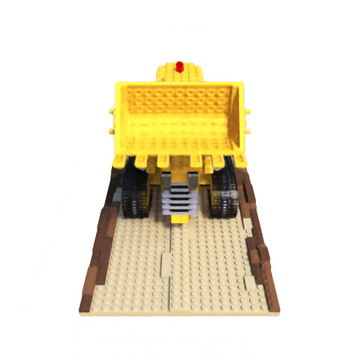
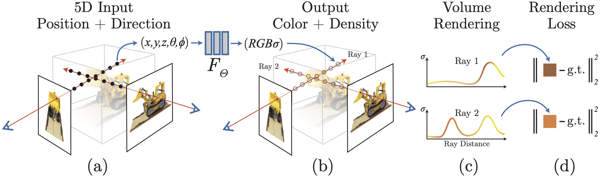

# NeRF-PyTorch


[NeRF](http://www.matthewtancik.com/nerf) (Neural Radiance Fields) is a method that achieves state-of-the-art results for synthesizing novel views of complex scenes. This project is a PyTorch implementation of NeRF, extended with [SIREN-based](https://arxiv.org/abs/2006.09661) and [MFN-based](https://arxiv.org/abs/2011.13961) NeRF variants. The code is based on the authors' original TensorFlow implementation [here](https://github.com/bmild/nerf).



## Installation

```
git clone https://github.com/josedelrey/nerf-pytorch.git
cd nerf-pytorch
conda env create -f environment.yml
conda activate nerf-pytorch
```

<details>
  <summary>Dependencies</summary>

  ## Dependencies
  - Python 3.8+
  - PyTorch 2.0+  (GPU optional)
  - numpy
  - imageio
  - pillow
  - tqdm
  - tensorboard
</details>

## How To Run?

### Quick Start

Download data for the `lego` dataset.

```bash
bash download_dataset.sh
```

Train the **baseline NeRF** on `lego`:

```bash
python run_nerf.py --config config/config_nerf_lego.txt
```

Train the **SIREN-NeRF** on `lego`:

```bash
python run_nerf.py --config config/config_siren_lego.txt
```

Train the **MFN (WaveletNet) NeRF** on `lego`:

```bash
python run_nerf.py --config config/config_wavelet_lego.txt
```

Logs are saved in:

```
./logs/<experiment_name>/
```

Model checkpoints are saved in:

```
./models/<experiment_name>/<experiment_name>_<step>.pth
```

Resume training from a checkpoint:

```bash
python run_nerf.py --config config/<your_config>.txt --resume ./models/<exp>/<exp>_050000.pth
```

### More Datasets

To use other scenes from the **NeRF Synthetic dataset**, you can download all datasets from:

[https://www.kaggle.com/datasets/nguyenhung1903/nerf-synthetic-dataset](https://www.kaggle.com/datasets/nguyenhung1903/nerf-synthetic-dataset)

Unzip them and place the scene folders inside the `datasets/` directory of this repository.  
The structure should look like this:

```
datasets/
├── lego/
├── chair/
├── drums/
├── ficus/
├── hotdog/
├── materials/
├── mic/
└── ship/
```

To train on a different dataset, edit the `dataset_path` parameter in the config file.  
For example, to train on **chair**, set:

```
dataset_path = ./datasets/chair
```

Then run:

```bash
python run_nerf.py --config config/config_nerf_chair.txt
```


## Method

[NeRF: Representing Scenes as Neural Radiance Fields for View Synthesis](http://tancik.com/nerf)  
 [Ben Mildenhall](https://people.eecs.berkeley.edu/~bmild/)\*<sup>1</sup>,
 [Pratul P. Srinivasan](https://people.eecs.berkeley.edu/~pratul/)\*<sup>1</sup>,
 [Matthew Tancik](http://tancik.com/)\*<sup>1</sup>,
 [Jonathan T. Barron](http://jonbarron.info/)<sup>2</sup>,
 [Ravi Ramamoorthi](http://cseweb.ucsd.edu/~ravir/)<sup>3</sup>,
 [Ren Ng](https://www2.eecs.berkeley.edu/Faculty/Homepages/yirenng.html)<sup>1</sup> <br>
 <sup>1</sup>UC Berkeley, <sup>2</sup>Google Research, <sup>3</sup>UC San Diego  
  \*denotes equal contribution  
  


> A neural radiance field is a simple fully connected network (weights are ~5MB) trained to reproduce input views of a single scene using a rendering loss. The network directly maps from spatial location and viewing direction (5D input) to color and opacity (4D output), acting as the "volume" so we can use volume rendering to differentiably render new views


## Citation

We acknowledge the original authors of NeRF for their groundbreaking work:
```
@misc{mildenhall2020nerf,
    title={NeRF: Representing Scenes as Neural Radiance Fields for View Synthesis},
    author={Ben Mildenhall and Pratul P. Srinivasan and Matthew Tancik and Jonathan T. Barron and Ravi Ramamoorthi and Ren Ng},
    year={2020},
    eprint={2003.08934},
    archivePrefix={arXiv},
    primaryClass={cs.CV}
}
```
